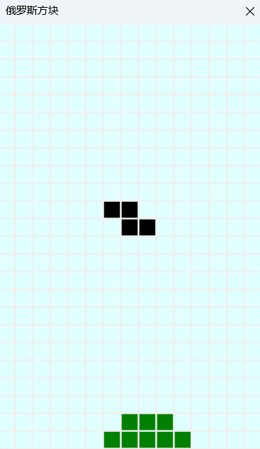

# TerisCSharp
Teris Demo With C Sharp WinForms.Draw the canvas using PictureBox.Image Property.
```C#
Bitmap bmap = new Bitmap({Width}, {Height});
// create Graphics object
Graphics g = Graphics.FromImage(bmap);

```


